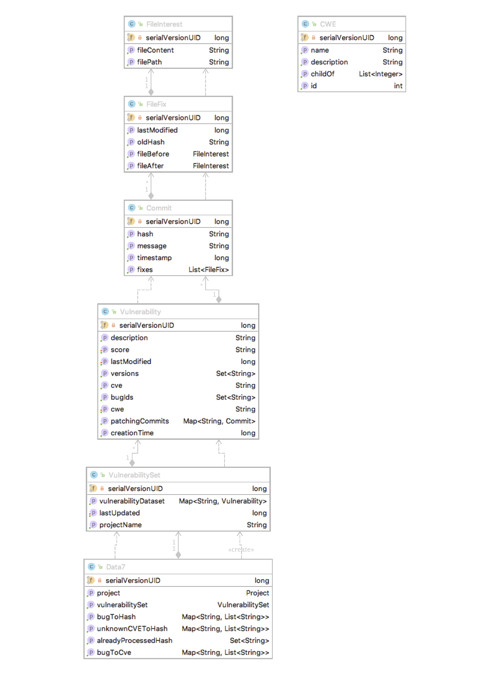

# Data7 Project: An automatically generated Vulnerability dataset

## What is it?

Data7 is a tool that put together vulnerability report and vulnerability patches  of a given software project in an automated way under the form of a dataset. Once created the dataset can then easily be updated with the latest information available. The information that can be found in the dataset is the following:
    
* CVE number
* description
* CWE number (if applicable)
* time of creation 
* time of last modification
* CVSS severity score
* bugs ids (if existing)   
* list of impacted versions
* list of commits that fixed the vulnerability
    * commits contains:
        * hash
        * timestamp
        * message
        * fixes (files in their states before and after fix)

## Why? 

When investigating a vulnerability, a security analyst need as much information as possible on it and usually reports are a good starting point. However, the most insightful piece of information on the vulnerability is usually the fix that was created to solve it. From the fix, the origin of the vulnerability and its type can be determined. Fixes when available can be found as separated links in the reports but it is far from being always the case. 
If linking fixes and report by hand is possible, it is time consumming. So when the analysis of not one but many vulnerabilities is considered then it is not possible to do it by hand anymore. A good example of a case where the analysis of large number of vulnerabilities is required is the creation of a Vulnerability Prediction Model. 

Thus, the link should be made automatically and not manually which is possible by cross checking information from vulnerability report, bug tracker and versioning history and that's precisely what data7 is doing.

## Requirements

To create and update a dataset an internet connection is required, however nothing is required to read an existing data7.
Other dependencies are handled through maven.

## How does it works ?
For a given project P

* Creating a dataset
    1. Data7 will first connect to the NVD database and download all the XML feeds for vulnerabilities (2002-Current Year)
    2. Data7 will then parse all the XML and retrieve all vulnerabilities reported for P over the history
    3. For each vulnerabilities, all declared links are analysed and if a mention to a bug report is made or a link to a fix commit is present, they are saved
    4. The git repository of P is cloned in a local folder
    5. For each vulnerability that had a link to a fixing commit, all information on the commit are retrieved from the git repository and added to the one of the vulnerability
    6. For each commit in the versioning history that was not yet analyzed in (v.), analyze the message and look for a bug id that was present in the report or for a CVE Identifier and if a matche is made then the commit information is added to the vulnerability information.

* Updating a dataset
    1. Data7 first check when was the latest update, if less than 7 days passed since the last update, only the modified and recent xml feed are downloaded, otherwise all xml feeds from years that have been modified since the last update are downloaded
    2. Data7 will then parse the XML and retrieve all vulnerabilities reported for P and create a new entry if there is a new vulnerability or update it if necessary
    3. For each updated or created vulnerability entry, look for new link of commit fix and/or bug id.
    4. The git repository is pulled
    5. For all new/updated entry  that have a new link, retrieve the commit information
    6. For all entry that have a new bug id, check whether this bug id was already found in the commit history (from a previous crawl)
    7. For all latest commit (since latest update), analyze the message and look for a bug id that was present in the report or for a CVE Identifier and if a matche is made then the commit information is added to the vulnerability information. 

## Dataset Structure

### API (binary form)

### XML exporter

## Supported projects

Currently four projects are supported :

* Linux Kernel
* Wireshark
* OpenSSL
* SystemD

but it can easily be extended to any other project where it is possible to find the following information:

*  name of the project as it appears in NVD database, e.g, linux_kernel
*  url of a git remote repository, e.g, https://github.com/torvalds/linux
*  regular expression catching link to remote repository and hashes in it, e.g, .*?(github\\.com|git\\.kernel\\.org).*?(commit)+.*?(h\\=|/)+([a-f0-9]+)
*  url of a bug tracker, e.g, https://bugzilla.kernel.org/
*  regular expression catching link to bug tracker and bug id in it, e.g, .*(bugzilla\\.kernel\\.org).*?(id\\=)([0-9]+)
*  regular expression catching bug id in git commit message, e.g, .*(bugzilla\\.kernel\\.org).*?(id\\=)([0-9]+)

## Functionality

The dataset can be created/updated at any time with the latest information available. 
The dataset can be exported in its binary form or in an XML equivalent which will only contains vulnerabilities with fixes.

## What's are the information in it

## How to use it

## How to integrate it to other tool?

